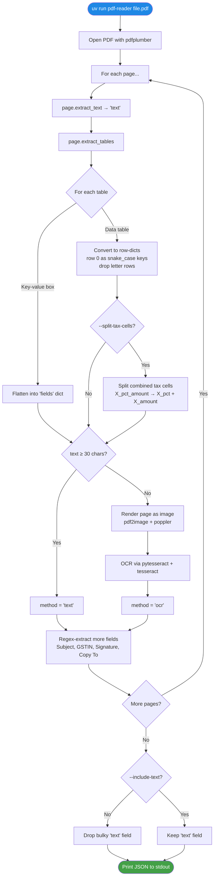

# pdf-to-json

*Developed by [Yash](https://www.linkedin.com/in/yashtomar-tech/) · Aeologic Technologies*

A Python script that reads a PDF (text-based **or** scanned) and prints clean,
structured JSON. Auto-detects the type and falls back to OCR for scans.

## Prerequisites

Install two system binaries and one Python tool:

```bash
# macOS
brew install tesseract poppler uv

# Ubuntu / Debian
sudo apt install tesseract-ocr poppler-utils
# install uv: https://docs.astral.sh/uv/getting-started/installation/
```

## Install

```bash
git clone https://github.com/yashtomer/pdf-to-json.git
cd pdf-to-json
uv sync
```

## Run

```bash
# Pass a PDF, get JSON on stdout
uv run pdf-reader path/to/file.pdf

# Save the JSON to a file
uv run pdf-reader path/to/file.pdf > result.json

# Pipe into jq
uv run pdf-reader path/to/file.pdf | jq '.pages[0].fields'

# Multiple PDFs (returns a JSON array)
uv run pdf-reader file1.pdf file2.pdf

# Write per-file JSON into a folder
uv run pdf-reader *.pdf --dump-json out/

# Human-readable summary instead of JSON
uv run pdf-reader file.pdf --summary
```

You can also run the script directly without uv:

```bash
python pdf_reader.py path/to/file.pdf
```

## How it works



| Step | What happens |
|---|---|
| Open PDF | `pdfplumber.open()` parses the file structure. |
| Text extraction | `page.extract_text()` returns the page's text in reading order. |
| Table extraction | `page.extract_tables()` returns each table as a list of rows. |
| Classify each table | "Key-value box" (labels ending in `:`) → `fields`. Otherwise → `tables`. |
| Tax-cell split | Optional: split `cgst_pct_amount` ("0.00% 0.00") into two fields. |
| Text vs OCR | If text is < 30 chars, render the page as an image and run Tesseract. |
| Regex fields | Pull `Subject`, `GSTIN`, signature block, `Copy To` list, etc. from text. |
| Drop `text` | Excluded from JSON by default (use `--include-text` to keep). |
| Output | Print structured JSON to stdout. |

## Use from Python

```python
from pdf_reader import pdf_to_json

data = pdf_to_json("path/to/file.pdf")    # returns a dict

# Common access patterns
print(data["pages"][0]["fields"]["work_order_no"])

for row in data["pages"][0]["tables"][0]:
    print(row["description"], row["total_amount_axbxc"])
```

To use it from a different project, install this folder as an editable
dependency:

```bash
# In your other project:
uv add /path/to/pdf-to-json
# or
pip install -e /path/to/pdf-to-json
```

## Output

```json
{
  "file": "file.pdf",
  "page_count": 3,
  "metadata": { "Producer": "..." },
  "pages": [
    {
      "page_number": 1,
      "method": "text",         // "text" | "ocr" | "empty"
      "char_count": 5375,
      "fields": {
        "work_order_no": "...",
        "date": "...",
        "...": "..."
      },
      "tables": [
        [
          { "s_no": "1", "description": "...", "total_amount_axbxc": "..." }
        ]
      ],
      "error": null
    }
  ],
  "error": null
}
```

* `fields` — key/value pairs extracted from header boxes + text regex
  (Work Order No, Date, Name, Address, Subject, Signature info, etc.).
  Keys are `snake_case`.
* `tables` — list of tables; each table is a list of row-dicts keyed by
  its column headers.

## CLI flags

| Flag | Purpose |
|---|---|
| `--summary` | Print a human-readable summary instead of JSON |
| `--dump-json DIR` | Also write per-file JSON to `DIR/<stem>.json` |
| `--dump-text DIR` | Also write per-file raw text to `DIR/<stem>.txt` |
| `--include-text` | Include the bulky raw `text` field in JSON (off by default) |
| `--no-split-tax-cells` | Keep combined `"X (%) /Amount"` cells as one field |
| `--no-ocr` | Skip OCR fallback (scanned pages return empty) |
| `--dpi N` | OCR resolution for scanned pages (default 400) |
| `--password PASS` | Password for encrypted PDFs |

## Dependencies

| Library | Why |
|---|---|
| [`pdfplumber`](https://github.com/jsvine/pdfplumber) | Read text and tables from native-text PDFs |
| [`pdf2image`](https://github.com/Belval/pdf2image) | Render a PDF page as an image (for OCR) |
| [`pytesseract`](https://github.com/madmaze/pytesseract) | OCR via the Tesseract engine |

System binaries the Python libs shell out to:

| Binary | Used by |
|---|---|
| `tesseract` | `pytesseract` (the OCR engine) |
| `poppler` | `pdf2image` (PDF page rendering) |

## More details

For the full story — every issue we hit while building this and how each one
was fixed — see [project-journey.html](project-journey.html).

---

Code developed by **Yash** ([LinkedIn](https://www.linkedin.com/in/yashtomar-tech/)), [Aeologic Technologies](https://aeologic.com).
